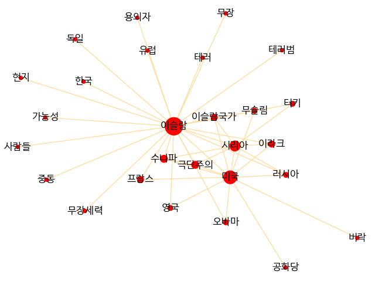
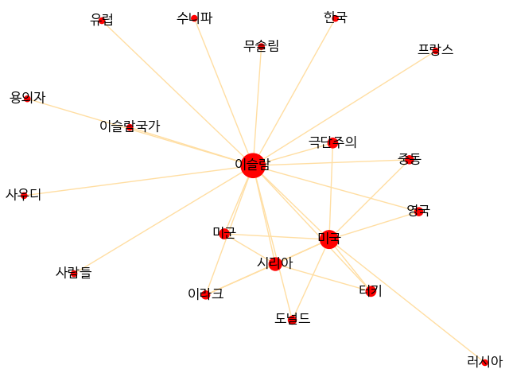
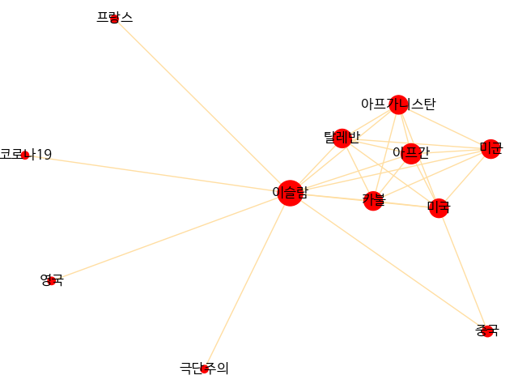

# 0. Contents

- [0. Contents](#0-contents)
- [1. GodsToImage](#1-godstoimage)
  - [1.1 natural language processing](#11-natural-language-processing)
- [2. Drawing network](#2-drawing-network)
  - [2.2 Python networkX](#22-python-networkx)
- [3. Results](#3-results)
  - [3.1 natural language processig results](#31-natural-language-processig-results)
    - [3.1.1 analysis](#311-analysis)

# 1. GodsToImage
    I had a question about the recoginitions of Islam in korea. So I made a plan to analyze it, and creating as drawing using AI.

## 1.1 natural language processing
First, we decided to analyze the news from BigKinds(빅카인즈). we collected the dataset
from the site, and divided the periods in 3 terms. 

1. The First period : **2015.08.01 ~ 2017.01.20**   
    In this period, EU or Europe take the refugees from Islam

2. The second period : **2017.01.20 ~ 2019.12.31**   
    Donald Trump, President of United State, rejected the refugees from
    other countries and reduce the acceptance of refugees.

3. The Third period : **2020.01.01 ~ 2021.12.31**   
    Pendamic season. The movement between countries drastically decreased due to virus. 

Next, we used 50 hot keywords column in Bigkinds excel columns. It can reduce the analysis time and show us the clear results. 

# 2. Drawing network
    drawing the graph by centrality. It will make easier to find out which elements affect Korean's recoginition about the Islam or the others. Because the dataset is too large, we use sql as origin dataset. with sqlite3, saved all of the keyword pairs in the normal directory present state : We have to modify the keyword spliting codes. 
## 2.2 Python networkX
We used the tool 'networkx'. of course their are many options such as Gephi and other programs, But we choose Python due to a high producibility. In networkx module, it supports the pagerank centrality. By using pagerank, we can get the network images. 

# 3. Results
## 3.1 natural language processig results
The first period result.

The second period result.

The Third period result.

### 3.1.1 analysis
    one of the most important characteristic is the arising of China. In the first, second periods, China does not occured in the graph. But the last periods, they occured in the relationship. It means that China influenced the Islam worldwide more deeper than before, and got the close relatioships to them while US kept them at arm's length.

    The next is the change of interest about the Islam country. In the first and second period, Usually Iraq and Syria is the center of the stage. But in the last period, Afghanistan took the higest interest because of the Taliban. 